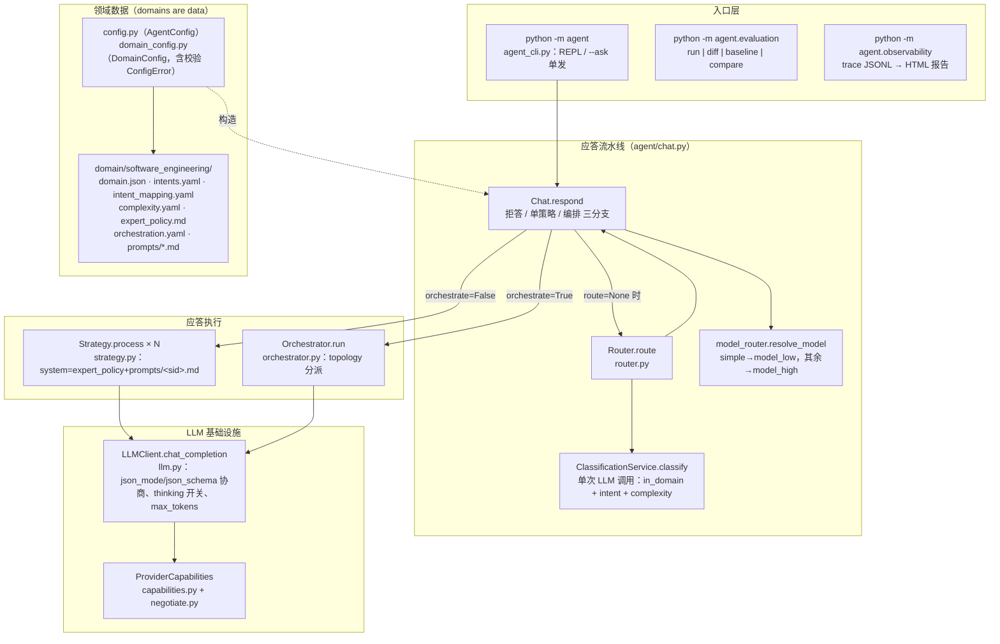
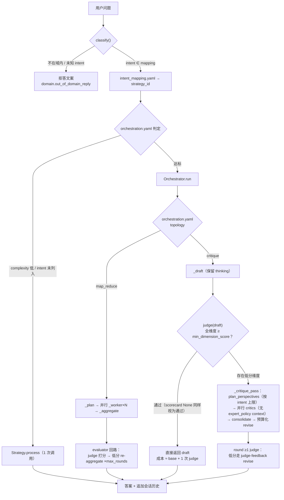
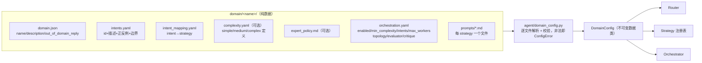
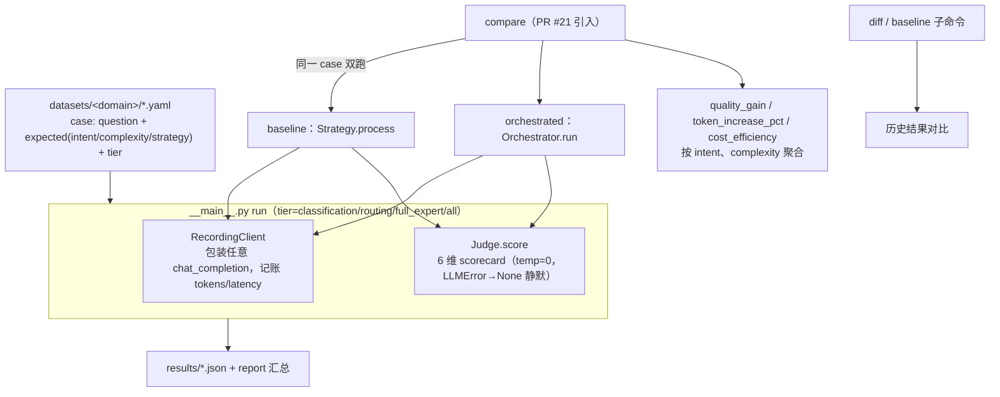
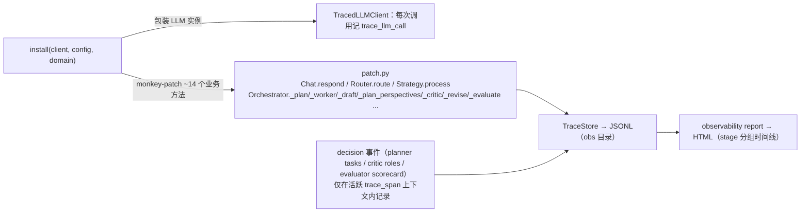

# ExpertForge 架构总览

> 更新日期：2026-08-25（对应 `main` @ `3165436`，gate-first critique 已合并）
>
> 本文由代码分析生成；模块行为以源码为准。相关设计文档见 `docs/superpowers/specs/`，专项调查见 `docs/superpowers/investigations/`。

ExpertForge 是一个**领域数据驱动**的 LLM 专家系统：切换专家领域只需更换一个数据目录（`domain/<name>/`），无需改代码（`tests/unit/test_domain_agnostic.py` 强制此约束）。核心链路是「分类路由 → 单次专家应答 或 编排应答」，外围配套评测框架与零侵入观测层。

## 1. 分层组件图

要点：

- **入口**：`agent_cli.main` 完成 `load_config → load_domain_config → get_api_key`，构建 `LLMClient` 后先经 `observability.install()` 包装再交给 REPL / 单发问答。
- **路由**（router.py）：一次分类调用产出三要素；`orchestrate = policy.enabled ∧ complexity ≥ min_complexity ∧ intent ∈ policy.intents`（全部来自 `orchestration.yaml`）。
- **模型分层**（model_router.py）：仅按 complexity 二分到 `model_low` / `model_high`。

## 2. 请求主流程

两种编排拓扑（orchestrator.py）：

| | map_reduce | critique（当前默认） |
|---|---|---|
| 作者 | 多 worker 各写一段 → aggregator 合成 | 单作者 draft，critic 只报缺陷不改写 |
| judge 位置 | 尾部回路（re-aggregate 改进） | **门控在前**（gate-first）；失败时进入管线，成功即早退 |
| 成本特征 | 多作者易矛盾（RC3，已弃用主线） | 通过路径 ≈ base + 1 次 judge；失败路径才付全套 |
| 失败降级 | planner 全败 → `_direct_answer` | critic/revise LLMError → 逐级回落 draft |

成本控制三件套（P2 措施 A/B/C，均配置化于 `orchestration.yaml` 的 `critique:` 块）：critics 不挂载生成端 context；视角数按 intent 设上限；revise 输出预算 = `clamp(ceil(draft_out × ratio), min, max)`。

## 3. 领域数据契约

新增领域 = 复制并修改这个目录，代码零改动。`CritiquePolicy`（视角上限、revise 预算）缺省即生效（default_max_perspectives=3 等），显式块可覆盖。

## 4. 评测框架（agent/evaluation/）

注意：`AGENT_API_KEY` 与 `AGENT_JUDGE_API_KEY` 相互独立；judge 缺 key 时评测命令直接 `Config error` 退出。

## 5. 观测层（agent/observability/）

设计铁律：观测永不破坏业务——所有写失败降级为 `warnings.warn`，未安装时全部为透明直通。已知约束：绕过 `Chat.respond` 直接调 `Orchestrator.run` 的代码（如 `evaluation/compare.py`）必须自建 `trace_span()`，否则 worker 决策事件静默缺失。

## 6. 关键不变量（改动前必读）

1. **Domains are data**：任何新领域/意图/策略调整只动 `domain/` 目录。
2. **观测与日志零侵入**：业务方法签名变更时必须同步 patch.py 的显式签名 wrapper。
3. **judge 失败语义统一为“视为通过”**：`Judge.score` 返回 None（LLMError/解析失败）在 gate 与尾部回路中都放行当前答案。
4. **map_reduce 为兼容保留路径**：主线质量修复都在 critique 拓扑上；两者共享 `_evaluate_loop` / worker_pool / 预算规则。
5. **单次抽样方差大**：thinking + temp 默认下补全长度可差数倍（见 [2026-08-25 方差调查](superpowers/investigations/2026-08-25-draft-output-variance-investigation.md)），per-case 单次 compare 百分比不具备结论力。
